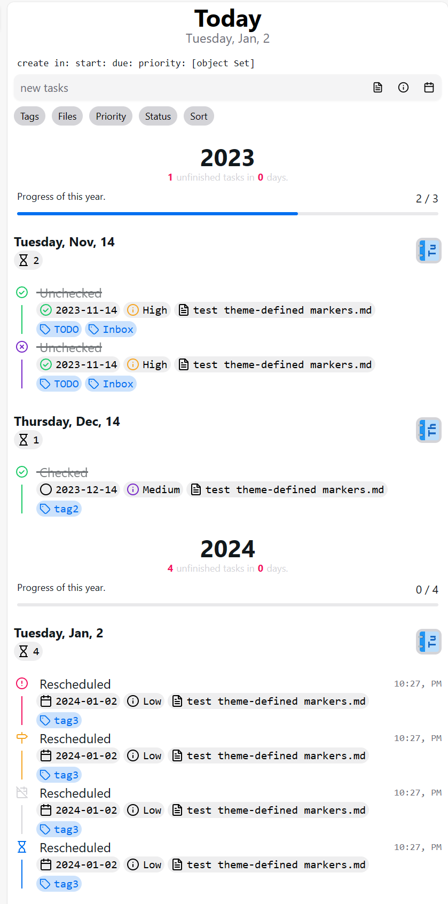

# tasks-timeline-view

> Made with create-react-library

[](https://www.npmjs.com/package/tasks-timeline-view) [](https://standardjs.com)

## Install

```bash
npm install --save tasks-timeline-view
```

## Usage

See `example/`.

Data preparation:

```ts
import moment from 'moment'
import {
  BasicTaskItemPriority,
  BasicTaskItemStatus,
  TaskItem
} from 'tasks-timeline-view'

export const TodoList: TaskItem[] = [
  {
    status: BasicTaskItemStatus.Done,
    priority: BasicTaskItemPriority.High,
    text: '- [x] Unchecked ✅ 2023-11-14',
    visual: 'Unchecked',
    tags: new Set(['tag1']),
    dateTime: {
      completion: moment('2023-11-14', 'YYYY-MM-DD'),
      misc: new Map()
    },
    position: {
      visual: 'test theme-defined markers.md'
    },
    meta: {}
  },
  {
    status: BasicTaskItemStatus.Done,
    priority: BasicTaskItemPriority.Medium,
    text: '- [x] Checked',
    visual: 'Checked',
    tags: new Set(['tag2']),
    dateTime: {
      created: moment('2023-12-14', 'YYYY-MM-DD'),
      misc: new Map()
    },
    position: {
      visual: 'test theme-defined markers.md'
    },
    meta: {}
  },
  {
    status: BasicTaskItemStatus.Overdue,
    priority: BasicTaskItemPriority.Low,
    text: '- [>] Rescheduled',
    visual: 'Rescheduled',
    dateTime: {
      due: moment(),
      misc: new Map()
    },
    tags: new Set(['tag3']),
    position: {
      visual: 'test theme-defined markers.md'
    },
    meta: {}
  }
]
```

render the view with data:

```tsx
import React from 'react'

import { TimelineView } from 'tasks-timeline-view'
import 'tasks-timeline-view/dist/index.css'
import { TodoList } from './taskList'

const App = () => {
  return <TimelineView taskList={TodoList} />
}

export default App
```

And the result:



Status change popup:


Task item edit:


Recurrence mode edit:


## License

MIT © [Leonezz](https://github.com/Leonezz)
